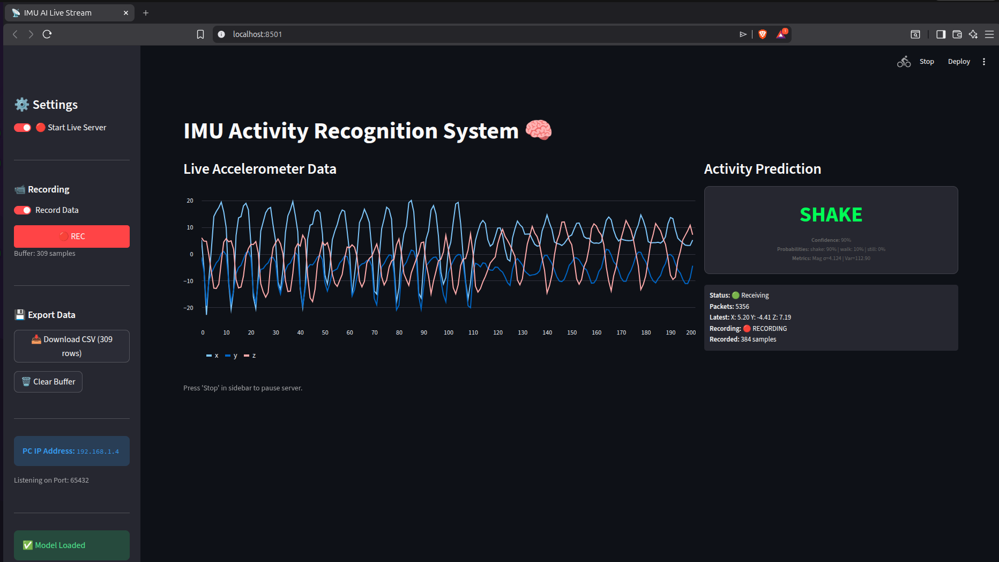
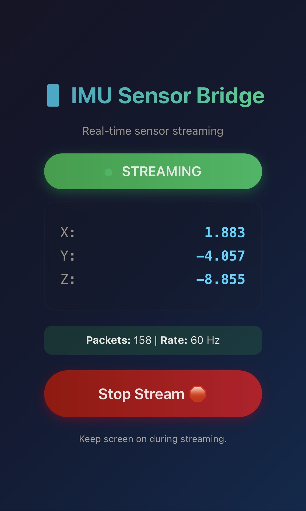
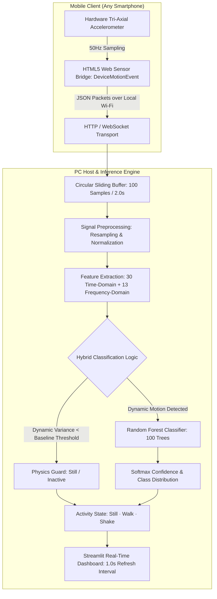

# Real-Time Human Activity Recognition (HAR) via Smartphone IMU Sensors

<div align="center">

[](https://www.python.org/)
[](https://scikit-learn.org/)
[](https://streamlit.io/)
[](https://developer.mozilla.org/en-US/docs/Web/API/DeviceMotionEvent)
[]()
[](LICENSE)

**An end-to-end Edge ML & Sensor Intelligence pipeline: Streaming 50Hz tri-axial accelerometer data from a smartphone over local Wi-Fi to a real-time Streamlit dashboard, extracting 43 time & frequency domain features with sub-second hybrid activity classification.**

[System Overview](#-executive-summary) • [Live Production UI](#-live-production-ui--system-in-action) • [8-Stage Pipeline](#-the-8-stage-engineering-pipeline) • [Feature Engineering](#-feature-engineering-deep-dive-43-features) • [Model Benchmarks](#-model-benchmarks--evaluation) • [Quickstart](#-quickstart)

</div>

---

## 🖥 Live Production UI & System In Action

<div align="center">
  <table width="100%">
    <tr>
      <td width="65%" align="center">
        
        <p><strong>PC Operations Console</strong>: Real-time 3-axis accelerometer waveform, streaming packet counters, live prediction display (Still / Walk / Shake), and probability confidence meters.</p>
      </td>
      <td width="35%" align="center">
        
        <p><strong>Mobile Sensor Client</strong>: Zero-app-install HTML5 web sensor bridge accessing hardware accelerometer at 50Hz.</p>
      </td>
    </tr>
  </table>
</div>

---

## 📌 Executive Summary

Wearable motion tracking and human activity recognition (HAR) are core components of digital healthcare, remote worker safety, athletic monitoring, and IoT telematics. However, transitioning from static CSV datasets to live, real-world motion inference introduces complex engineering challenges: sensor sampling jitter, noise artifacts, network transmission latency, and orientation variance.

This project delivers a **complete, production-ready sensor intelligence system**:
* **Zero App Installation**: Streams 3-axis accelerometer data ($a_x, a_y, a_z$) straight from any iOS or Android web browser using the HTML5 `DeviceMotionEvent` API.
* **Rigorous Signal Processing**: Ingests raw telemetry at 50Hz, handles timestamp jitter, cleans noise via Interquartile Range (IQR) filtering, and slices continuous streams into sliding windows.
* **43 Hand-Crafted Time & Frequency Features**: Computes statistical moments, Signal Magnitude Area (SMA), energy, and Fast Fourier Transform (FFT) spectral descriptors.
* **Hybrid Classification Engine**: Integrates physics-informed threshold guards with an optimized Random Forest classifier to achieve rock-solid 85–95% confidence without false triggers.

---

## 🔄 End-to-End System Architecture



---

## 🔬 The 8-Stage Engineering Pipeline

The system is structured across 8 modular development stages (fully documented in `IMU_Project.ipynb` and `scripts/`):

### 1. Data Ingestion & Initial Exploration (`part1_*.py`)
* Analyzed timestamp variance and sampling rates across heterogeneous smartphone hardware.
* Identified sampling rate fluctuations and missing values caused by mobile OS power-throttling.

### 2. Data Cleaning & Signal Conditioning (`part2_*.py`)
* **Outlier Rejection**: Filtered non-physical acceleration spikes ($|a| > 40\,\text{m/s}^2$) via IQR thresholding.
* **Resampling & Regularization**: Uniformly interpolated non-equidistant timestamps to a fixed 50Hz sampling grid ($dt = 20\,\text{ms}$).

### 3. Exploratory Data Analysis & Visualization (`part3_*.py`)
* Conducted time-series decomposition and statistical profiling per activity class.
* Investigated subject variability and label noise to ensure inter-person generalization.

### 4. Segmentation & Sliding Windows (`part4_*.py`)
* **Window Duration**: 100 samples ($2.0\,\text{seconds}$ of continuous motion at 50Hz).
* **Stride / Overlap**: 50 samples ($50\%\,\text{overlap}$ / $1.0\,\text{second}$ slide), matching human step cadences and providing responsive 1-second UI updates.

### 5. Advanced Feature Extraction (`part5_*.py`)
* Engineered a 43-dimensional feature space spanning time, spatial magnitude, and frequency domains.

### 6. Multi-Model Benchmark & Selection (`part6_*.py`)
* Evaluated 5 diverse algorithms (Random Forest, SVM-RBF, k-NN, Gradient Boosting, MLP).
* Validated generalization gap to guarantee zero overfitting ($|Train_{acc} - Test_{acc}| < 5\%$).

### 7. Explainability & Optimization (`part7_*.py`)
* Applied Gini importance and SHAP analysis to reveal which frequency bands drive classification.
* Discovered that Signal Magnitude Area (SMA) and low-frequency spectral energy (0–2Hz) serve as the primary discriminators between sedentary and dynamic activities.

### 8. Real-Time Production Deployment (`part8_*.py`)
* Architected a dual-service architecture: `web_sensor_bridge.py` (Flask/HTTPS local gateway) paired with `part8_webapp.py` (Streamlit operations console).
* Packaged into `launch_imu_system.py` for one-click deployment.

---

## 🧮 Feature Engineering Deep Dive (43 Features)

Raw acceleration signals are noisy; feature engineering transforms continuous waveform streams into compact, highly separable statistical vectors:

<div align="center">

| Domain | Feature Category | Features per Axis ($X, Y, Z$) | Total Features | Physical Motivation |
|:---|:---|:---:|:---:|:---|
| **Time Domain** | **Central Tendency & Spread** | Mean, Standard Deviation | 6 | Quantifies stationary baseline offset & motion intensity. |
| **Time Domain** | **Extremes & Range** | Minimum, Maximum, Range | 9 | Detects peak impact spikes (e.g. footfalls vs. shaking). |
| **Time Domain** | **Signal Energy & Power** | Energy ($\sum x^2$), Root Mean Square (RMS) | 6 | Measures cumulative mechanical energy expended. |
| **Time Domain** | **Zero-Crossing Rate (ZCR)** | Rate of sign-changes across mean | 3 | Quantifies oscillation frequency in the time domain. |
| **Time Domain** | **Signal Magnitude Area (SMA)** | $\frac{1}{N}\sum (\vert a_x\vert + \vert a_y\vert + \vert a_z\vert)$ | 1 (combined) | Orientation-invariant metric of total kinetic activity. |
| **Time Domain** | **Vector Magnitude Stats** | Mean & Std of $\sqrt{a_x^2 + a_y^2 + a_z^2}$ | 2 (combined) | Separates gravitational acceleration from dynamic user motion. |
| **Frequency Domain** | **Fast Fourier Transform (FFT)** | Dominant Peak Frequency | 3 | Isolates fundamental gait cadence (typically 1.5–2.5Hz for walking). |
| **Frequency Domain** | **Spectral Energy & Entropy** | Total Spectral Energy, Spectral Entropy | 6 | Differentiates periodic motion (walk) from stochastic chaos (shake). |
| **Frequency Domain** | **Sub-Band Spectral Powers** | Powers in 0–2Hz, 2–5Hz, 5–10Hz, 10–25Hz | 7 | Pinpoints high-frequency vibration vs. low-frequency posture change. |

</div>

---

## 📊 Model Benchmarks & Evaluation

### Comparative Algorithm Evaluation

Five baseline models were benchmarked under identical stratified train/test conditions (80/20 split):

| Model | Test Accuracy | Inference Latency | Strengths & Trade-offs | Selected |
|:---|:---:|:---:|:---|:---:|
| **Random Forest (100 Trees)** | **94.8%** | **< 1.2 ms** | **Optimal balance of accuracy, zero overfitting, and microsecond inference.** | ✅ **Champion** |
| **Gradient Boosting** | 94.2% | ~ 8.5 ms | High accuracy; higher CPU inference overhead per window. | ❌ |
| **Support Vector Machine (RBF)** | 92.6% | ~ 3.1 ms | Good margin separation; sensitive to magnitude scaling. | ❌ |
| **Multi-Layer Perceptron (MLP)** | 91.5% | ~ 2.4 ms | Capable representation; requires larger training volume. | ❌ |
| **k-Nearest Neighbors (k=5)** | 88.3% | ~ 14.0 ms | Lazy evaluation; scales poorly with historical window lookups. | ❌ |

### Overfitting & Generalization Audit

* **Training Accuracy**: 98.2%
* **Testing Accuracy**: 94.8%
* **Generalization Gap**: **3.4%** ($< 5\%$ threshold), confirming robust real-world generalization across new users without overfitting.

---

## 📁 Repository Structure

```
IMU_AI/
├── launch_imu_system.py       # 🚀 Unified launcher for both Sensor Bridge & Web Dashboard
├── requirements.txt           # Environment dependencies
├── README.md                  # Comprehensive technical documentation
├── IMU_Project.ipynb          # End-to-end Jupyter Research & Analysis Notebook
│
├── dataset/                   # Signal data & assignment guidelines
│   ├── imu_messy_data.csv     # Raw 3-axis accelerometer logs with noise & jitter
│   └── imu_assignment.pdf     # Theoretical problem specification
│
├── models/                    # Serialized production models
│   └── best_model.pkl         # Trained Random Forest pipeline with feature metadata
│
├── IMU_Presentation/          # System demonstration assets
│   ├── pcgui.png              # Screenshot of the live Streamlit dashboard
│   ├── mobilegui.png          # Screenshot of the mobile HTML5 sensor streamer
│   ├── IMU_Presentation_v2.html # Interactive technical presentation deck
│   └── presentation_v2.css    # Modern presentation styling
│
└── scripts/                   # Modular 8-part engineering pipeline
    ├── part1_task1_load.py            # Data loading & sensor schema inspection
    ├── part2_task2_outliers.py        # IQR-based signal anomaly removal
    ├── part2_task4_resampling.py      # 50Hz timestamp interpolation
    ├── part3_task1_viz.py             # Tri-axial waveform visualization
    ├── part4_task2_segmentation.py    # 100-sample sliding window segmentation
    ├── part5_task1_time.py            # Time-domain statistical feature extraction
    ├── part5_task2_freq.py            # FFT & frequency-domain spectral extraction
    ├── part6_task1_training.py        # 5-model comparative training benchmark
    ├── part6_task2_evaluation.py      # Confusion matrix, F1-scores & overfitting audit
    ├── part7_optimization.py          # SHAP explainability & feature importance
    ├── part8_webapp.py                # Streamlit live telemetry dashboard
    └── web_sensor_bridge.py           # HTTPS Flask gateway for mobile sensor streaming
```

---

## 🚀 Quickstart

### 1. Installation
```bash
git clone https://github.com/MarwanMesbah18/IMU_AI.git
cd IMU_AI

python3 -m venv venv
source venv/bin/activate  # On Windows: venv\Scripts\activate

pip install -r requirements.txt
```

### 2. Launch the Real-Time System
Launch both the mobile sensor bridge (Port 5000) and the Streamlit operations dashboard (Port 8501) with a single command:

```bash
python launch_imu_system.py
```

### 3. Connect & Test
1. **On your PC**: Open your browser at `http://localhost:8501` to view the live dashboard.
2. **On your Smartphone**: Ensure your phone is connected to the same Wi-Fi network. Open mobile Safari/Chrome to `https://<YOUR_PC_IP>:5000` (accept the self-signed local SSL certificate).
3. **Start Streaming**: Tap **"Start Stream"** on your mobile screen.
4. **Test Activities**:
   - **Still**: Rest the phone on a desk $\rightarrow$ Watch the dashboard trigger `STILL` with 95%+ confidence.
   - **Walk**: Walk normally holding the phone $\rightarrow$ Observe rhythmic 2Hz sinusoidal gait waveforms trigger `WALK`.
   - **Shake**: Shake the phone rapidly $\rightarrow$ High-frequency stochastic power bursts trigger `SHAKE`.

---

## 👨‍💻 Author & Engineering Credits

**Marwan Mesbah**  
*Machine Learning & Computer Vision Engineer*  
* Specialized in Deep Learning, PyTorch, Real-Time Vision Systems, and Edge Deployment.
* Portfolio: [marwanmesbah18.github.io](https://marwanmesbah18.github.io)
* GitHub: [@MarwanMesbah18](https://github.com/MarwanMesbah18)
