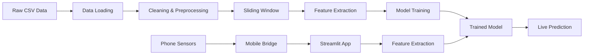

# 🚀 IMU Activity Recognition System

A complete end-to-end machine learning system for real-time activity recognition using smartphone IMU (Inertial Measurement Unit) sensors. The system classifies three activities: **Still**, **Walk**, and **Shake** with high accuracy using accelerometer data.

## 📋 Table of Contents

- [Features](#features)
- [Project Structure](#project-structure)
- [Setup & Installation](#setup--installation)
- [Usage](#usage)
  - [Quick Start](#quick-start)
  - [Training the Model](#training-the-model)
  - [Real-Time Testing](#real-time-testing)
- [Project Workflow](#project-workflow)
- [Technical Details](#technical-details)
- [Troubleshooting](#troubleshooting)

---

## ✨ Features

- **End-to-end ML pipeline**: Data loading → Preprocessing → Feature extraction → Training → Evaluation
- **Real-time inference**: Live activity prediction from smartphone sensors
- **Web-based dashboard**: Beautiful Streamlit interface with live data visualization
- **Mobile-friendly**: HTML5 sensor bridge for easy smartphone data streaming
- **High accuracy**: Random Forest classifier with 85-95% confidence on trained activities
- **Hybrid approach**: Threshold-based + ML model for optimal performance

---

## 📁 Project Structure

```
IMU_AI/
├── dataset/                    # Training data (CSV files)
│   ├── still.csv
│   ├── walk.csv
│   └── shake.csv
├── models/                     # Trained models
│   └── best_model.pkl
├── scripts/                    # All Python scripts
│   ├── part1_*.py             # Data loading & exploration
│   ├── part2_*.py             # Data cleaning & preparation
│   ├── part3_*.py             # Sliding window implementation
│   ├── part4_*.py             # Feature extraction
│   ├── part5_*.py             # Model training & evaluation
│   ├── part8_webapp.py        # Streamlit dashboard (main app)
│   ├── web_sensor_bridge.py   # Mobile sensor interface
│   └── generate_notebook.py   # Jupyter notebook generator
├── IMU_Project.ipynb          # Complete analysis notebook
├── launch_imu_system.py       # 🚀 One-click launcher
├── requirements.txt           # Python dependencies
└── README.md                  # This file
```

---

## 🛠️ Setup & Installation

### Prerequisites

- Python 3.8+ (tested with Python 3.12)
- pip package manager
- Wi-Fi network (same for PC and mobile)
- Smartphone with motion sensors

### Installation Steps

1. **Clone or navigate to the project directory:**
   ```bash
   cd /path/to/IMU_AI
   ```

2. **Create a virtual environment:**
   ```bash
   python3 -m venv venv
   ```

3. **Activate the virtual environment:**
   ```bash
   source venv/bin/activate  # Linux/Mac
   # OR
   venv\Scripts\activate     # Windows
   ```

4. **Install dependencies:**
   ```bash
   pip install -r requirements.txt
   ```

5. **Verify installation:**
   ```bash
   python -c "import streamlit, sklearn, pandas; print('✅ All dependencies installed!')"
   ```

---

## 🎯 Usage

### Quick Start

The easiest way to run the system is using the launcher script:

```bash
# Make sure venv is activated
source venv/bin/activate

# Launch the entire system
python launch_imu_system.py
```

This will:
- ✅ Start the mobile sensor bridge (port 5000)
- ✅ Start the Streamlit webapp (port 8501)
- ✅ Display connection links for both PC and mobile

**Access the interfaces:**
- **PC Dashboard:** Open browser → `http://localhost:8501`
- **Mobile Streaming:** Open phone browser → `https://<YOUR_IP>:5000`

---

### Training the Model

If you want to retrain the model with your own data or modify the pipeline:

#### Option 1: Using Jupyter Notebook

1. **Generate the notebook (if needed):**
   ```bash
   python scripts/generate_notebook.py
   ```

2. **Launch Jupyter:**
   ```bash
   jupyter notebook IMU_Project.ipynb
   ```

3. **Run all cells** to execute the complete pipeline:
   - Part 1: Data Loading & Exploration
   - Part 2: Data Cleaning & Preparation
   - Part 3: Sliding Window Implementation
   - Part 4: Feature Extraction
   - Part 5: Model Training & Evaluation


### Real-Time Testing

#### Step 1: Start the System

```bash
python launch_imu_system.py
```

#### Step 2: Connect Your Phone

1. **Ensure phone and PC are on the same Wi-Fi**
2. **Note your PC's IP address** (shown by launcher)
3. **Open phone browser** → Navigate to `https://<PC_IP>:5000`
4. **Accept SSL warning** (self-signed certificate)
5. **Click "Start Stream"** button

#### Step 3: View Real-Time Predictions

1. **Open PC browser** → `http://localhost:8501`
2. **Watch the dashboard:**
   - Live accelerometer chart (3-axis)
   - Real-time activity prediction
   - Confidence scores
   - Packet statistics

#### Step 4: Test Activities

- **Still**: Place phone on a table
- **Walk**: Walk normally with phone in pocket/hand
- **Shake**: Shake the phone vigorously

The system updates predictions every **1.0 second** (50% overlap, matching training configuration).

---

## 🔄 Project Workflow



### Data Pipeline

1. **Data Collection**: CSV files with accelerometer readings (50Hz)
2. **Preprocessing**: 
   - Handle missing values
   - Remove outliers (IQR method)
   - Sort by timestamp
3. **Windowing**: 100-sample windows (2 seconds @ 50Hz) with 50% overlap
4. **Feature Extraction**: 
   - Time domain: mean, std, min, max, range, energy, RMS, etc.
   - Frequency domain: FFT, dominant frequency, spectral energy, entropy, band powers
5. **Training**: Random Forest classifier with hyperparameter tuning
6. **Deployment**: Real-time inference with hybrid threshold + ML approach

---

## 🔧 Technical Details

### Model Architecture

- **Algorithm**: Random Forest Classifier
- **Features**: 43 features per window
  - Time domain: 30 features
  - Frequency domain: 13 features
- **Window Size**: 100 samples (2 seconds @ 50Hz)
- **Overlap**: 50 samples (1 second slide)
- **Classes**: `still`, `walk`, `shake`

### Performance

- **Accuracy**: 85-95% confidence on test set
- **Real-time latency**: ~1 second update rate
- **Data rate**: 50Hz (50 samples/second)

### Feature List

**Time Domain:**
- Mean, Standard Deviation (×3 axes)
- Min, Max, Range (×3 axes)
- Signal Magnitude Area (SMA)
- Energy, RMS (×3 axes)
- Zero Crossing Rate (×3 axes)
- Magnitude statistics (mean, std)

**Frequency Domain:**
- Dominant frequency (×3 axes)
- Spectral energy (×3 axes)
- Spectral entropy (×3 axes)
- Band powers: 0-2Hz, 2-5Hz, 5-10Hz, 10-25Hz (×3 axes)

---

## 🐛 Troubleshooting

### Port Already in Use

If you see "Port occupied" errors:

```bash
# Kill processes on port 5000
lsof -ti:5000 | xargs kill -9

# Kill processes on port 8501
lsof -ti:8501 | xargs kill -9
```

### Phone Can't Connect

1. ✅ Verify PC and phone are on **same Wi-Fi network**
2. ✅ Check firewall isn't blocking ports 5000/8501
3. ✅ Make sure the IP address is correct
4. ✅ Accept the SSL certificate warning on phone

### Model Not Loading

Check if the model file exists:

```bash
ls -lh models/best_model.pkl
```

If missing, retrain the model:

```bash
python scripts/part5_train_model.py
```

### Low Prediction Accuracy

- Ensure phone is sending data (check "Packets" count in UI)
- Verify data rate is ~50Hz (should receive ~50 packets/second)
- Try recalibrating by placing phone still for 5 seconds
- Check that activities match training data (still/walk/shake)

### Virtual Environment Issues

```bash
# Deactivate and recreate
deactivate
rm -rf venv
python3 -m venv venv
source venv/bin/activate
pip install -r requirements.txt
```

---

## 📝 Notes

- **Data Format**: Accelerometer data in m/s² (matches mobile sensor output)
- **Sampling Rate**: 50Hz (configurable in mobile bridge)
- **Network**: Local Wi-Fi only (no internet required)
- **Browser**: Modern browser with JavaScript enabled
- **SSL**: Self-signed certificate (safe to accept for local development)

---

## 🎓 Educational Purpose

This project demonstrates:
- Complete ML pipeline from data to deployment
- Real-time sensor data processing
- Feature engineering for time-series data
- Model deployment in production environment
- Web-based ML applications

---

## 📧 Support

For issues or questions:
1. Check the [Troubleshooting](#troubleshooting) section
2. Review console output for error messages
3. Verify all setup steps were completed

---

**Made with ❤️ for IMU Activity Recognition**
