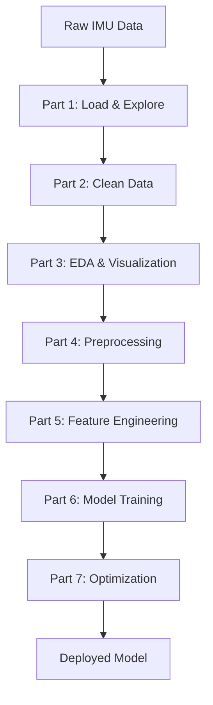

# IMU Data Pipeline - Comprehensive Guide
# دليل شامل لخط أنابيب بيانات وحدة القياس بالقصور الذاتي (IMU)

This README explains each part of the IMU data analysis pipeline, what each graph means, and the real-world significance.

هذا الدليل يشرح كل جزء من خط أنابيب تحليل بيانات IMU، ومعنى كل رسم بياني، وأهميته في الحياة الواقعية.

---

## Table of Contents / جدول المحتويات

1. [Part 1: Data Loading & Initial Exploration](#part-1-data-loading--initial-exploration)
2. [Part 2: Data Cleaning](#part-2-data-cleaning)
3. [Part 3: Exploratory Data Analysis (EDA)](#part-3-exploratory-data-analysis-eda)
4. [Part 4: Data Preprocessing](#part-4-data-preprocessing)
5. [Part 5: Feature Engineering](#part-5-feature-engineering)
6. [Part 6: Model Training & Evaluation](#part-6-model-training--evaluation)
7. [Part 7: Model Optimization](#part-7-model-optimization)

---

# Part 1: Data Loading & Initial Exploration
# الجزء الأول: تحميل البيانات والاستكشاف الأولي

## English

### Overview
This part performs the initial data loading and basic exploration to understand what we're working with.

### Task 1.1: Loading the Dataset (`part1_task1_load.py`)

**What it does:**
- Loads the IMU sensor data from a CSV file
- Displays the first 20 rows
- Shows dataset shape, column names, and data types
- Calculates summary statistics

**Key Questions Answered:**
- **How many samples?** → Total number of measurements recorded
- **Timestamp range?** → The duration of data collection
- **Min/Max of acceleration axes?** → Physical measurement range (±g or m/s²)
- **Class distribution?** → How many samples per activity (Walking, Standing, etc.)

**Real-World Meaning:**
IMU sensors are found in smartphones, fitness trackers, and medical devices. This data represents human movement captured by accelerometers measuring motion in 3 axes (X, Y, Z). Understanding the data range helps us verify if measurements are physically realistic (e.g., 1g ≈ 9.8 m/s² for gravity).

### Task 1.2: Missing Value Analysis (`part1_task2_missing.py`)

**What it does:**
- Counts missing values per column
- Calculates percentage of missing data
- Visualizes missing data patterns with a heatmap

**The Heatmap Graph:**
- **Yellow regions** = Missing data
- **Purple regions** = Valid data
- **Patterns matter**: Random scattered yellow = random failures; Blocks of yellow = sensor dropout periods

**Real-World Meaning:**
Sensors fail! Maybe the battery died, the device lost contact with skin, or software glitched. Knowing WHERE and WHEN data is missing helps us decide if we can recover it or must discard certain segments.

### Task 1.3: Timestamp Analysis (`part1_task3_timestamp.py`)

**What it does:**
- Checks if timestamps are sorted
- Calculates time intervals between samples
- Identifies gaps and duplicates

**Real-World Meaning:**
At 50Hz sampling, we expect a sample every 0.02 seconds. Gaps > 1 second mean the sensor stopped recording. This could indicate the user removed the device, software crashed, or separate recording sessions were merged.

---

## Arabic / العربية

### نظرة عامة
هذا الجزء يقوم بتحميل البيانات الأولية والاستكشاف الأساسي لفهم ما نعمل عليه.

### المهمة 1.1: تحميل مجموعة البيانات

**ما يفعله:**
- يحمّل بيانات مستشعر IMU من ملف CSV
- يعرض أول 20 صفًا
- يُظهر شكل البيانات وأسماء الأعمدة وأنواعها
- يحسب الإحصائيات الوصفية

**الأسئلة الرئيسية المُجاب عليها:**
- **كم عدد العينات؟** ← إجمالي القياسات المسجلة
- **نطاق الطابع الزمني؟** ← مدة جمع البيانات
- **أدنى/أقصى قيم التسارع؟** ← نطاق القياس الفيزيائي
- **توزيع الفئات؟** ← عدد العينات لكل نشاط

**المعنى الحقيقي:**
مستشعرات IMU موجودة في الهواتف الذكية وأجهزة تتبع اللياقة والأجهزة الطبية. تمثل هذه البيانات حركة الإنسان الملتقطة بواسطة مقاييس التسارع التي تقيس الحركة في 3 محاور (X، Y، Z).

### المهمة 1.2: تحليل القيم المفقودة

**ما يفعله:**
- يحسب القيم المفقودة لكل عمود
- يحسب النسبة المئوية للبيانات المفقودة
- يُظهر الأنماط المفقودة بخريطة حرارية

**رسم الخريطة الحرارية:**
- **المناطق الصفراء** = بيانات مفقودة
- **المناطق البنفسجية** = بيانات صالحة
- **الأنماط مهمة**: أصفر متناثر = أعطال عشوائية؛ كتل صفراء = فترات توقف المستشعر

**المعنى الحقيقي:**
المستشعرات تفشل! ربما نفدت البطارية، أو فقد الجهاز الاتصال بالجلد، أو حدث خلل برمجي. معرفة أين ومتى البيانات مفقودة يساعدنا في تحديد ما إذا كان يمكننا استردادها.

### المهمة 1.3: تحليل الطابع الزمني

**ما يفعله:**
- يتحقق من ترتيب الطوابع الزمنية
- يحسب الفواصل الزمنية بين العينات
- يحدد الفجوات والتكرارات

**المعنى الحقيقي:**
عند أخذ عينات بمعدل 50 هرتز، نتوقع عينة كل 0.02 ثانية. الفجوات > ثانية واحدة تعني توقف المستشعر عن التسجيل.

---

# Part 2: Data Cleaning
# الجزء الثاني: تنظيف البيانات

## English

### Overview
This part addresses data quality issues: missing values, outliers, duplicates, and irregular sampling.

### Task 2.1: Handling Missing Values (`part2_task1_missing_values.py`)

**Three Strategies:**

1. **Forward Fill**: Use the last known value to fill gaps
   - *Real-world*: Like assuming you're still standing because you were standing a moment ago
   - *Pros*: Simple, works in real-time
   - *Cons*: Creates step-like artifacts

2. **Linear Interpolation**: Draw a straight line between known points
   - *Real-world*: If you were at point A and then at point C, you probably passed through B
   - *Pros*: Smoother, more realistic for continuous motion
   - *Cons*: Requires future data (can't use in real-time)

3. **Drop Rows**: Delete rows with missing values
   - *Real-world*: Better to have less but accurate data
   - *Pros*: Preserves true signal
   - *Cons*: Loses temporal continuity and data quantity

**The Comparison Graph:**
Shows the same time segment with different fill strategies. The original shows gaps, forward fill shows flat steps, interpolation shows smooth curves.

**Recommendation:**
Linear interpolation is best for IMU data because physical motion is continuous.

### Task 2.2: Outlier Detection (`part2_task2_outliers.py`)

**Two Detection Methods:**

1. **Z-Score Method**: Values > 3 standard deviations from mean
   - Assumes normal distribution
   - Good for true sensor errors

2. **IQR Method**: Values beyond 1.5 × Interquartile Range
   - Distribution-free
   - More conservative, flags more outliers

**The Box Plot:**
- The box shows 25th-75th percentile (middle 50% of data)
- Whiskers extend to 1.5×IQR
- Dots outside = outliers

**Real-World Meaning:**
Outliers could be:
- **True events**: A person fell, creating a huge impact spike
- **Sensor errors**: Electrical noise, loose connection
- **Treatment**: Clipping (cap extreme values) or interpolation (treat as missing)

### Task 2.3: Duplicate Removal (`part2_task3_duplicates.py`)

**What it does:**
- Identifies exact duplicates (all columns identical)
- Identifies measurement duplicates (same timestamp + sensor values)
- Removes duplicates keeping the first occurrence

**Real-World Meaning:**
Duplicates occur from software bugs, data logging errors, or merging files incorrectly. They artificially inflate dataset size without adding information.

### Task 2.4: Resampling (`part2_task4_resampling.py`)

**What it does:**
- Converts timestamps to datetime index
- Sorts data chronologically
- Resamples to exact 50Hz (one sample every 20ms)

**The 5-Second Window Graph:**
Shows the resampled signal with perfectly uniform time intervals.

**Real-World Meaning:**
Machine learning algorithms expect uniform time steps. If your watch recorded at 48Hz sometimes and 52Hz other times, we standardize to exact 50Hz. This is critical for:
- Accurate frequency analysis (FFT)
- Consistent feature extraction
- Fair model training

---

## Arabic / العربية

### نظرة عامة
هذا الجزء يعالج مشاكل جودة البيانات: القيم المفقودة، القيم الشاذة، التكرارات، وعدم انتظام أخذ العينات.

### المهمة 2.1: معالجة القيم المفقودة

**ثلاث استراتيجيات:**

1. **الملء الأمامي**: استخدام آخر قيمة معروفة لملء الفجوات
   - *الحياة الواقعية*: كافتراض أنك لا تزال واقفًا لأنك كنت واقفًا قبل لحظة
   - *المزايا*: بسيط، يعمل في الوقت الحقيقي
   - *العيوب*: يخلق تشوهات خطوية

2. **الاستيفاء الخطي**: رسم خط مستقيم بين النقاط المعروفة
   - *الحياة الواقعية*: إذا كنت في النقطة أ ثم في ج، ربما مررت بـ ب
   - *المزايا*: أكثر سلاسة وواقعية للحركة المستمرة
   - *العيوب*: يتطلب بيانات مستقبلية

3. **حذف الصفوف**: حذف الصفوف ذات القيم المفقودة
   - *الحياة الواقعية*: أفضل أن يكون لديك بيانات أقل ولكن دقيقة
   - *المزايا*: يحافظ على الإشارة الحقيقية
   - *العيوب*: يفقد الاستمرارية الزمنية

**التوصية:**
الاستيفاء الخطي هو الأفضل لبيانات IMU لأن الحركة الفيزيائية مستمرة.

### المهمة 2.2: اكتشاف القيم الشاذة

**طريقتان للكشف:**

1. **طريقة Z-Score**: القيم أكبر من 3 انحرافات معيارية عن المتوسط
2. **طريقة IQR**: القيم خارج 1.5 × المدى الربيعي

**رسم الصندوق:**
- الصندوق يُظهر المئين 25-75 (الـ 50% الوسطى من البيانات)
- الشوارب تمتد إلى 1.5×IQR
- النقاط خارج = قيم شاذة

**المعنى الحقيقي:**
القيم الشاذة قد تكون:
- **أحداث حقيقية**: شخص سقط، يخلق ذروة تأثير ضخمة
- **أخطاء المستشعر**: ضوضاء كهربائية، اتصال رخو

### المهمة 2.3: إزالة التكرارات

**ما يفعله:**
- يحدد التكرارات الدقيقة وتكرارات القياس
- يزيل التكرارات مع الاحتفاظ بالحدوث الأول

**المعنى الحقيقي:**
التكرارات تحدث من أخطاء البرمجيات أو أخطاء تسجيل البيانات.

### المهمة 2.4: إعادة أخذ العينات

**ما يفعله:**
- يحول الطوابع الزمنية إلى فهرس تاريخ ووقت
- يرتب البيانات زمنيًا
- يعيد أخذ العينات إلى 50 هرتز بالضبط

**المعنى الحقيقي:**
خوارزميات التعلم الآلي تتوقع خطوات زمنية موحدة. هذا حاسم لتحليل التردد الدقيق واستخراج الميزات المتسقة.

---

# Part 3: Exploratory Data Analysis (EDA)
# الجزء الثالث: تحليل البيانات الاستكشافي

## English

### Task 3.1: Time-Series Visualization (`part3_task1_viz.py`)

**What it does:**
- Plots 10-second segments for each activity
- Shows all three axes (X, Y, Z) plus acceleration magnitude

**The Time-Series Graphs:**
Each subplot represents a different activity (Walking, Standing, Shaking, etc.):

- **Stationary (Still/Standing)**: Flat lines with minor noise. Z-axis typically shows ~9.8 m/s² (gravity)
- **Walking**: Periodic/rhythmic waves. Each peak = one step. Frequency ~1-2 Hz (typical walking cadence)
- **Running**: Higher amplitude and frequency than walking
- **Shaking**: Chaotic high-frequency, high-amplitude patterns

**Acceleration Magnitude:**
||a|| = √(x² + y² + z²)

This combines all three axes into one value. It's **rotation-invariant**, meaning it doesn't matter how the device is oriented. Whether your phone is sideways or upside down, the magnitude captures the "total movement energy."

**Real-World Meaning:**
These patterns are the foundation of activity recognition:
- Your fitness tracker counts steps by detecting walking periodicity
- Fall detection looks for sudden high-magnitude spikes followed by stillness
- Sleep tracking identifies micro-movements during rest

### Task 3.2: Statistical Analysis (`part3_task2_stats.py`)

**What it does:**
- Calculates mean, std, min, max per activity
- Creates box plots comparing activities
- Generates histograms for each axis/activity
- Computes correlation matrices

**The Box Plots:**
Compare the "spread" of acceleration values across activities. Activities with tight boxes (low variance) are calm; wide boxes indicate vigorous movement.

**The Histograms:**
Show the distribution shape:
- **Normal/Bell curve**: Typical for random noise or smooth motion
- **Multimodal (multiple peaks)**: Suggests different sub-activities or transitions
- **Skewed**: Indicates asymmetric movement (e.g., swinging only forward)

**Correlation Matrices:**
Show if X, Y, Z axes move together:
- High correlation → Axes move in sync (e.g., jumping up and down)
- Low correlation → Independent movement (e.g., rotation)

### Task 3.3: Subject Variability (`part3_task3_subject.py`)

**What it does:**
- Groups data by subject (person)
- Compares acceleration magnitude across subjects
- Calculates Coefficient of Variation (CV = std/mean)

**The Grouped Bar Chart:**
Shows that different people produce different signal amplitudes for the same activity:
- Person A might swing their arms vigorously while walking
- Person B might have small, controlled movements
- Sensor placement varies (pocket vs. hand vs. wrist)

**Real-World Meaning:**
This variability is why fitness apps need calibration! A model trained only on Person A might fail for Person B.

**Solution: Per-Subject Normalization**
Standardize each person's data separately so the model learns activity PATTERNS rather than personal intensity.

### Task 3.4: Label Noise Investigation (`part3_task4_label_noise.py`)

**What it does:**
- Identifies samples that deviate significantly from their labeled class
- Uses Z-score to find suspicious samples
- Visualizes potential mislabeled data

**Real-World Meaning:**
Data labeling is often done manually and errors happen:
- Annotator labeled "Walking" but person was actually standing
- Transition periods (sitting → standing) have ambiguous labels
- Wrong labels confuse machine learning models

**Impact on ML:**
Noisy labels → Confused decision boundaries → Lower accuracy

---

## Arabic / العربية

### المهمة 3.1: التصور الزمني للسلاسل

**ما يفعله:**
- يرسم مقاطع 10 ثوانٍ لكل نشاط
- يُظهر جميع المحاور الثلاثة (X، Y، Z) بالإضافة إلى مقدار التسارع

**الرسوم البيانية الزمنية:**
كل رسم فرعي يمثل نشاطًا مختلفًا:

- **ثابت (واقف)**: خطوط مسطحة مع ضوضاء طفيفة. المحور Z يُظهر عادة ~9.8 م/ث² (الجاذبية)
- **المشي**: موجات دورية/إيقاعية. كل ذروة = خطوة واحدة. التردد ~1-2 هرتز
- **الجري**: سعة وتردد أعلى من المشي
- **الاهتزاز**: أنماط فوضوية عالية التردد والسعة

**مقدار التسارع:**
||a|| = √(x² + y² + z²)

هذا يجمع جميع المحاور الثلاثة في قيمة واحدة. إنه **ثابت الدوران**، مما يعني أنه لا يهم كيف يتم توجيه الجهاز.

**المعنى الحقيقي:**
هذه الأنماط هي أساس التعرف على النشاط:
- متتبع اللياقة يحسب الخطوات من خلال اكتشاف دورية المشي
- اكتشاف السقوط يبحث عن ذروات مقدار مفاجئة تليها سكون

### المهمة 3.2: التحليل الإحصائي

**ما يفعله:**
- يحسب المتوسط، الانحراف المعياري، الأدنى، الأقصى لكل نشاط
- يُنشئ رسوم بيانية صندوقية تقارن الأنشطة
- يولد مدرجات تكرارية لكل محور/نشاط
- يحسب مصفوفات الارتباط

**الرسوم البيانية الصندوقية:**
تقارن "انتشار" قيم التسارع عبر الأنشطة. الأنشطة ذات الصناديق الضيقة = هادئة؛ الصناديق الواسعة = حركة نشطة.

### المهمة 3.3: تباين الموضوع

**ما يفعله:**
- يجمع البيانات حسب الموضوع (الشخص)
- يقارن مقدار التسارع عبر الأشخاص

**الرسم البياني الشريطي المجمع:**
يُظهر أن أشخاصًا مختلفين ينتجون سعات إشارة مختلفة لنفس النشاط.

**المعنى الحقيقي:**
هذا التباين هو سبب حاجة تطبيقات اللياقة للمعايرة! النموذج المُدرب فقط على الشخص أ قد يفشل للشخص ب.

**الحل: التطبيع لكل موضوع**
توحيد بيانات كل شخص بشكل منفصل.

### المهمة 3.4: التحقيق في ضوضاء التسميات

**ما يفعله:**
- يحدد العينات التي تنحرف بشكل كبير عن فئتها المُسماة
- يستخدم Z-score للعثور على عينات مشبوهة

**المعنى الحقيقي:**
تسمية البيانات غالبًا ما تتم يدويًا والأخطاء تحدث. التسميات الخاطئة تربك الحدود القرارية للتعلم الآلي.

---

# Part 4: Data Preprocessing (Detailed)
# الجزء الرابع: المعالجة المسبقة للبيانات (تفصيلي)

## English

### Overview: Why Preprocessing Matters

Raw sensor data cannot be fed directly into machine learning models. Preprocessing transforms messy, variable-length, personalized signals into clean, uniform, comparable features. This part covers three critical preprocessing steps:

1. **Normalization** - Making values comparable across different scales
2. **Segmentation** - Cutting continuous streams into fixed-size windows
3. **Gap Handling** - Dealing with discontinuities in time

---

### Task 4.1: Normalization Strategies (`part4_task1_normalization.py`)

#### Why Normalize?

Consider these scenarios:
- Person A walks with arms swinging: acceleration reaches ±15 m/s²
- Person B walks calmly: acceleration only reaches ±5 m/s²
- Both are doing the SAME activity (walking)

Without normalization, a model might learn: "high acceleration = walking" based on Person A, then fail completely on Person B.

#### Strategy 1: Z-Score (Global Standardization)

**Mathematical Formula:**
```
x' = (x - μ) / σ

Where:
  x  = original value
  μ  = mean of all values in the dataset
  σ  = standard deviation of all values
  x' = normalized value
```

**Step-by-Step Example:**
```
Original data: [10, 12, 14, 16, 18]
Mean (μ) = (10+12+14+16+18)/5 = 14
Std (σ) = √[(16+4+0+4+16)/5] = √8 ≈ 2.83

Normalized:
  10 → (10-14)/2.83 = -1.41
  12 → (12-14)/2.83 = -0.71
  14 → (14-14)/2.83 =  0.00
  16 → (16-14)/2.83 = +0.71
  18 → (18-14)/2.83 = +1.41
```

**Properties:**
- Mean of normalized data = 0
- Standard deviation = 1
- Most values fall between -3 and +3 (99.7% for normal distribution)
- Preserves the SHAPE of the distribution

**Real-World Analogy:**
Like grading students on a curve. Instead of raw scores (60, 70, 80), you report how many standard deviations above/below average each student is.

**When to Use:**
- When you want to compare values across different features (acc_x vs acc_y)
- When features have different units or scales
- Default choice for most ML algorithms (SVM, Neural Networks)

#### Strategy 2: Min-Max Scaling

**Mathematical Formula:**
```
x' = (x - x_min) / (x_max - x_min)

Where:
  x_min = minimum value in dataset
  x_max = maximum value in dataset
```

**Step-by-Step Example:**
```
Original data: [10, 12, 14, 16, 18]
Min = 10, Max = 18

Normalized:
  10 → (10-10)/(18-10) = 0.00
  12 → (12-10)/(18-10) = 0.25
  14 → (14-10)/(18-10) = 0.50
  16 → (16-10)/(18-10) = 0.75
  18 → (18-10)/(18-10) = 1.00
```

**Properties:**
- All values scaled to [0, 1] range
- Minimum becomes 0, Maximum becomes 1
- DANGER: Extremely sensitive to outliers!

**The Outlier Problem:**
```
Data with outlier: [10, 12, 14, 16, 1000]
Min = 10, Max = 1000

Normalized:
  10  → 0.00
  12  → 0.002    ← Almost zero!
  14  → 0.004    ← Almost zero!
  16  → 0.006    ← Almost zero!
  1000 → 1.00

Result: All useful data compressed into 0.00-0.01 range!
```

**When to Use:**
- When you specifically need bounded outputs (e.g., image pixels 0-255)
- When data has NO outliers
- **NOT recommended for IMU data** (impacts from falls create extreme outliers)

#### Strategy 3: Per-Subject Standardization

**Concept:**
Apply Z-score separately for EACH person's data, not globally.

**Mathematical Formula:**
```
For each subject s:
  x'_s = (x_s - μ_s) / σ_s

Where:
  μ_s = mean of subject s's data only
  σ_s = std of subject s's data only
```

**Why This Matters - Visual Example:**

```
Before Per-Subject Normalization:
┌─────────────────────────────────────────┐
│ Subject A (Vigorous walker):            │
│   Walking: ████████████████ (high)      │
│   Standing: ████ (medium)               │
│                                         │
│ Subject B (Calm walker):                │
│   Walking: ████████ (medium)            │
│   Standing: ██ (low)                    │
└─────────────────────────────────────────┘
Problem: Subject A's "standing" looks like Subject B's "walking"!

After Per-Subject Normalization:
┌─────────────────────────────────────────┐
│ Subject A (Normalized to A's range):    │
│   Walking: ████████████████ (high)      │
│   Standing: ████ (low)                  │
│                                         │
│ Subject B (Normalized to B's range):    │
│   Walking: ████████████████ (high)      │
│   Standing: ████ (low)                  │
└─────────────────────────────────────────┘
Result: Both subjects now show same PATTERN for same activity!
```

**Real-World Analogy:**
Instead of asking "How many steps did you take?" (absolute), we ask "How active were you compared to YOUR usual day?" (relative to personal baseline).

**When to Use:**
- When training data comes from multiple people
- When you want the model to focus on ACTIVITY PATTERNS, not person identity
- Critical for wearable apps that must work for new users

#### The 4-Panel Comparison Graph Explained

```
Panel 1 - Original Data:
┌────────────────────────────────────┐
│  Values between -20 and +20 m/s²  │
│  ∿∿∿∿∿∿∿∿∿∿∿∿∿∿∿∿∿∿∿∿∿∿∿∿        │
│  Natural sensor range              │
└────────────────────────────────────┘

Panel 2 - Z-Score Normalized:
┌────────────────────────────────────┐
│  Values between -3 and +3          │
│  ∿∿∿∿∿∿∿∿∿∿∿∿∿∿∿∿∿∿∿∿∿∿∿∿        │
│  Same SHAPE, centered at 0         │
└────────────────────────────────────┘

Panel 3 - Min-Max Scaled:
┌────────────────────────────────────┐
│  Values between 0 and 1            │
│  ∿∿∿∿∿∿∿∿∿∿∿∿∿∿∿∿∿∿∿∿∿∿∿∿        │
│  Same shape, shifted/compressed    │
└────────────────────────────────────┘

Panel 4 - Per-Subject:
┌────────────────────────────────────┐
│  Values between -3 and +3          │
│  ∿∿∿∿∿∿∿∿∿∿∿∿∿∿∿∿∿∿∿∿∿∿∿∿        │
│  Shape relative to this person     │
└────────────────────────────────────┘
```

---

### Task 4.2: Sliding Window Segmentation (`part4_task2_segmentation.py`)

#### Why Segment?

Machine learning models need fixed-size inputs:
- Neural networks have fixed input layers
- Random Forests need feature vectors of same length
- You can't feed "3 hours of continuous data" into a model

Segmentation solves this by cutting the continuous stream into digestible chunks.

#### The Sliding Window Concept

**Parameters:**
- **Window Size**: Duration of each segment (e.g., 2 seconds)
- **Overlap**: How much consecutive windows share (e.g., 50%)
- **Sampling Rate**: How many samples per second (e.g., 50 Hz)

**Calculation:**
```
Window Size (samples) = Window Size (seconds) × Sampling Rate
                      = 2 seconds × 50 Hz = 100 samples

Step Size = Window Size × (1 - Overlap)
          = 100 × (1 - 0.50) = 50 samples
```

#### Visual Representation of Overlapping Windows

```
Continuous Signal (200 samples shown):
├────────────────────────────────────────────────────────────────┤
│ ■■■■■■■■■■■■■■■■■■■■■■■■■■■■■■■■■■■■■■■■■■■■■■■■■■■■■■■■■■■■■■ │
│ 0                   50                  100                 150                 200 │
├────────────────────────────────────────────────────────────────┤

Sliding Windows with 50% Overlap:
                                                                  
Window 1: [0-100]
├─────────────────────────────────────────┤
│ ████████████████████████████████████████│
├─────────────────────────────────────────┤

Window 2: [50-150] (overlaps 50 samples with Window 1)
          ├─────────────────────────────────────────┤
          │ ████████████████████████████████████████│
          ├─────────────────────────────────────────┤

Window 3: [100-200]
                    ├─────────────────────────────────────────┤
                    │ ████████████████████████████████████████│
                    ├─────────────────────────────────────────┤
```

**Without Overlap (0%):**
- Window 1: samples 0-99
- Window 2: samples 100-199
- Problem: Information at sample 99-100 boundary might be split across windows

**With 50% Overlap:**
- Window 1: samples 0-99
- Window 2: samples 50-149
- Window 3: samples 100-199
- Benefit: Every sample appears in 2 windows (except edges)
- Result: 2× more training examples!

#### Window Shape and ML Input

Each window becomes a 3D array:
```
Window Shape: [window_length, num_channels]
            = [100, 3]  (100 samples × 3 axes: X, Y, Z)

Multiple Windows Shape: [num_windows, window_length, num_channels]
                      = [500, 100, 3]  (500 windows of 100×3)
```

#### Handling Activity Transitions (Majority Voting)

**The Problem:**
What if a window contains samples from TWO activities?

```
Activity Timeline:
├────────Walking────────┼────────Standing────────┤
                     ↑
              Window covering transition
```

**Solution: Majority Voting**
```python
Window labels: [Walk, Walk, Walk, Walk, Walk, Walk, Stand, Stand, Stand, Stand]
Count: Walk=6, Stand=4
Majority Label: "Walk" (6 > 4)
```

**Alternative Approaches:**
1. **Discard mixed windows** - Safer but loses data
2. **Require 100% agreement** - Very strict
3. **Majority voting (used here)** - Practical compromise

#### Window Size Trade-offs - Detailed Analysis

| Window Size | Samples (50Hz) | Pros | Cons | Best For |
|-------------|----------------|------|------|----------|
| **0.5s** | 25 | Ultra-fast response, memory efficient | Might not capture full gesture cycle | Quick gestures, taps |
| **1s** | 50 | Fast response, captures 1-2 steps | Limited context for complex activities | Walking detection |
| **2s** | 100 | Captures 3-4 steps, good balance | Moderate latency | General activity recognition |
| **4s** | 200 | Rich context, stable features | High latency, more mixed windows | Complex activities (yoga poses) |
| **10s** | 500 | Very stable statistics | Unusable for real-time apps | Offline analysis only |

**Physical Intuition:**
- Walking frequency ≈ 2 Hz (2 steps/second) → Need at least 0.5s to see one step
- Running frequency ≈ 3 Hz → 0.33s minimum
- For reliable classification, capture 2-4 repetitions → 2s window for walking

---

### Task 4.3: Handling Gaps and Missing Segments (`part4_task3_gaps.py`)

#### Why Gaps Occur

Real-world sensor data is NEVER perfectly continuous:

| Gap Type | Duration | Cause | Frequency |
|----------|----------|-------|-----------|
| **Micro-gaps** | <0.1s | Bluetooth packet loss | Common |
| **Short gaps** | 1-5s | Momentary sensor freeze | Occasional |
| **Medium gaps** | 5-60s | User removed device | Common |
| **Long gaps** | >60s | Device charging, swimming | Planned |

#### Detecting Gaps

**Algorithm:**
```python
# Calculate time difference between consecutive samples
time_diffs = df.index.to_series().diff()

# Expected interval at 50Hz
expected = 0.02 seconds (20ms)

# A gap is any interval >> expected
# Using 5 seconds as threshold for "major gap"
major_gaps = time_diffs > 5.0 seconds
```

#### Session Splitting Visualization

```
Original Timeline with Gap:
├────────────────────────────┼─────────30 sec gap──────────┼────────────────────────────┤
│ Session 1 (Morning workout)│          No Data            │ Session 2 (Afternoon walk) │
├────────────────────────────┼─────────────────────────────┼────────────────────────────┤
   10:00                    10:15                          10:16                        10:30

After Split:
┌─────────────────────────────┐  ┌─────────────────────────────┐
│ Session 1                   │  │ Session 2                   │
│ Duration: 15 minutes        │  │ Duration: 14 minutes        │
│ Samples: 45,000             │  │ Samples: 42,000             │
└─────────────────────────────┘  └─────────────────────────────┘
```

#### Why Windows Should NOT Span Gaps

**Bad Scenario (Window spanning gap):**
```
Time:    ├───────────────────────────────────┤
         10:14:59.98   GAP    10:15:30.00
Signal:  [walking...]   ∅     [...standing]
Window:  [walk walk walk ??? stand stand stand]

What the model sees:
- Sudden jump from walking motion to standing
- No transition period
- Physically impossible (teleportation)
```

**Good Scenario (Separate sessions segmented independently):**
```
Session 1 Windows:                    Session 2 Windows:
[walk walk walk walk]                 [stand stand stand stand]
[walk walk walk walk]                 [stand stand stand stand]
... clean data ...                    ... clean data ...
```

#### Impact on Machine Learning

| Handling Method | Effect on Training | Effect on Model |
|-----------------|-------------------|-----------------|
| **Ignore gaps** | Windows contain discontinuities | Model learn false patterns (teleportation) |
| **Interpolate across gaps** | Invented data fills gaps | Model learns fake transitions |
| **Split into sessions** | Clean, continuous data only | Model learns true physics |

**Recommendation:**
ALWAYS split into sessions based on gaps. Never interpolate or ignore gaps > 1 second.

---

## Arabic / العربية

### نظرة عامة: لماذا المعالجة المسبقة مهمة

لا يمكن إدخال بيانات المستشعر الخام مباشرة في نماذج التعلم الآلي. المعالجة المسبقة تحوّل الإشارات الفوضوية المتغيرة الطول والشخصية إلى ميزات نظيفة وموحدة وقابلة للمقارنة.

---

### المهمة 4.1: استراتيجيات التطبيع (تفصيلي)

#### لماذا نطبّع؟

اعتبر هذه السيناريوهات:
- الشخص أ يمشي مع تأرجح الذراعين: التسارع يصل إلى ±15 م/ث²
- الشخص ب يمشي بهدوء: التسارع يصل فقط إلى ±5 م/ث²
- كلاهما يقوم بنفس النشاط (المشي)

بدون التطبيع، قد يتعلم النموذج: "تسارع عالي = مشي" بناءً على الشخص أ، ثم يفشل تمامًا مع الشخص ب.

#### الاستراتيجية 1: Z-Score (التوحيد القياسي العام)

**الصيغة الرياضية:**
```
x' = (x - μ) / σ

حيث:
  x  = القيمة الأصلية
  μ  = متوسط جميع القيم في مجموعة البيانات
  σ  = الانحراف المعياري لجميع القيم
  x' = القيمة المُطبّعة
```

**مثال خطوة بخطوة:**
```
البيانات الأصلية: [10، 12، 14، 16، 18]
المتوسط (μ) = (10+12+14+16+18)/5 = 14
الانحراف المعياري (σ) = √[(16+4+0+4+16)/5] = √8 ≈ 2.83

المُطبّعة:
  10 → (10-14)/2.83 = -1.41
  12 → (12-14)/2.83 = -0.71
  14 → (14-14)/2.83 =  0.00
  16 → (16-14)/2.83 = +0.71
  18 → (18-14)/2.83 = +1.41
```

**الخصائص:**
- متوسط البيانات المُطبّعة = 0
- الانحراف المعياري = 1
- معظم القيم تقع بين -3 و +3
- يحافظ على شكل التوزيع

**تشبيه واقعي:**
مثل تقييم الطلاب على منحنى. بدلاً من الدرجات الخام (60، 70، 80)، تُبلّغ عن عدد الانحرافات المعيارية فوق أو تحت المتوسط.

#### الاستراتيجية 2: التحجيم بالحد الأدنى-الأقصى

**الصيغة الرياضية:**
```
x' = (x - x_min) / (x_max - x_min)

حيث:
  x_min = القيمة الدنيا في مجموعة البيانات
  x_max = القيمة القصوى في مجموعة البيانات
```

**مشكلة القيم الشاذة:**
```
بيانات مع قيمة شاذة: [10، 12، 14، 16، 1000]
الأدنى = 10، الأقصى = 1000

المُطبّعة:
  10   → 0.00
  12   → 0.002    ← تقريبًا صفر!
  14   → 0.004    ← تقريبًا صفر!
  16   → 0.006    ← تقريبًا صفر!
  1000 → 1.00

النتيجة: جميع البيانات المفيدة مضغوطة في نطاق 0.00-0.01!
```

**متى تستخدم:**
- **غير موصى به لبيانات IMU** (الصدمات من السقوط تخلق قيم شاذة متطرفة)

#### الاستراتيجية 3: التوحيد لكل موضوع (شخص)

**المفهوم:**
تطبيق Z-score بشكل منفصل لبيانات كل شخص، وليس عالميًا.

**لماذا هذا مهم:**

```
قبل التوحيد لكل موضوع:
┌─────────────────────────────────────────┐
│ الموضوع أ (مشي نشط):                    │
│   المشي: ████████████████ (عالي)        │
│   الوقوف: ████ (متوسط)                  │
│                                         │
│ الموضوع ب (مشي هادئ):                   │
│   المشي: ████████ (متوسط)               │
│   الوقوف: ██ (منخفض)                    │
└─────────────────────────────────────────┘
المشكلة: "وقوف" الموضوع أ يشبه "مشي" الموضوع ب!

بعد التوحيد لكل موضوع:
┌─────────────────────────────────────────┐
│ الموضوع أ (مُطبّع لنطاق أ):             │
│   المشي: ████████████████ (عالي)        │
│   الوقوف: ████ (منخفض)                  │
│                                         │
│ الموضوع ب (مُطبّع لنطاق ب):             │
│   المشي: ████████████████ (عالي)        │
│   الوقوف: ████ (منخفض)                  │
└─────────────────────────────────────────┘
النتيجة: كلا الموضوعين يُظهران نفس النمط لنفس النشاط!
```

**تشبيه واقعي:**
بدلاً من السؤال "كم خطوة مشيت؟" (مطلق)، نسأل "ما مدى نشاطك مقارنة بيومك المعتاد؟" (نسبي لخط الأساس الشخصي).

---

### المهمة 4.2: التقسيم بالنافذة المنزلقة (تفصيلي)

#### لماذا نقسّم؟

نماذج التعلم الآلي تحتاج مدخلات بحجم ثابت:
- الشبكات العصبية لها طبقات إدخال ثابتة
- لا يمكنك إدخال "3 ساعات من البيانات المستمرة" في نموذج

التقسيم يحل هذا بتقطيع التدفق المستمر إلى قطع قابلة للهضم.

#### مفهوم النافذة المنزلقة

**المعلمات:**
- **حجم النافذة**: مدة كل مقطع (مثلاً 2 ثانية)
- **التداخل**: كم تتشارك النوافذ المتتالية (مثلاً 50%)
- **معدل أخذ العينات**: كم عينة في الثانية (مثلاً 50 هرتز)

**الحساب:**
```
حجم النافذة (عينات) = حجم النافذة (ثوانٍ) × معدل أخذ العينات
                    = 2 ثانية × 50 هرتز = 100 عينة

حجم الخطوة = حجم النافذة × (1 - التداخل)
           = 100 × (1 - 0.50) = 50 عينة
```

#### تمثيل بصري للنوافذ المتداخلة

```
الإشارة المستمرة (200 عينة):
│ ■■■■■■■■■■■■■■■■■■■■■■■■■■■■■■■■■■■■■■■■■■■■■■■■■■■■■■■■■■■■■■ │
│ 0                   50                  100                 150                 200 │

النوافذ المنزلقة مع تداخل 50%:
                                                                  
النافذة 1: [0-100]
│ ████████████████████████████████████████│

النافذة 2: [50-150] (تتداخل 50 عينة مع النافذة 1)
          │ ████████████████████████████████████████│

النافذة 3: [100-200]
                    │ ████████████████████████████████████████│
```

**بدون تداخل (0%):**
- النافذة 1: العينات 0-99
- النافذة 2: العينات 100-199
- المشكلة: المعلومات عند حدود 99-100 قد تنقسم عبر النوافذ

**مع تداخل 50%:**
- النافذة 1: العينات 0-99
- النافذة 2: العينات 50-149
- النافذة 3: العينات 100-199
- الفائدة: كل عينة تظهر في نافذتين
- النتيجة: 2× أمثلة تدريب أكثر!

#### مفاضلات حجم النافذة - تحليل تفصيلي

| حجم النافذة | العينات (50 هرتز) | الإيجابيات | السلبيات | الأفضل لـ |
|-------------|-------------------|------------|----------|-----------|
| **0.5 ثانية** | 25 | استجابة فائقة السرعة | قد لا تلتقط دورة الإيماءة الكاملة | الإيماءات السريعة |
| **1 ثانية** | 50 | استجابة سريعة، تلتقط 1-2 خطوة | سياق محدود | اكتشاف المشي |
| **2 ثانية** | 100 | تلتقط 3-4 خطوات، توازن جيد | تأخر متوسط | التعرف على النشاط العام |
| **4 ثوانٍ** | 200 | سياق غني، ميزات مستقرة | تأخر عالي | الأنشطة المعقدة (وضعيات اليوغا) |

---

### المهمة 4.3: معالجة الفجوات والمقاطع المفقودة (تفصيلي)

#### لماذا تحدث الفجوات

بيانات المستشعر في العالم الحقيقي ليست أبدًا مستمرة تمامًا:

| نوع الفجوة | المدة | السبب | التكرار |
|------------|-------|-------|---------|
| **فجوات دقيقة** | <0.1 ثانية | فقدان حزمة بلوتوث | شائع |
| **فجوات قصيرة** | 1-5 ثوانٍ | تجمد مؤقت للمستشعر | أحيانًا |
| **فجوات متوسطة** | 5-60 ثانية | المستخدم أزال الجهاز | شائع |
| **فجوات طويلة** | >60 ثانية | شحن الجهاز، السباحة | مخططة |

#### لماذا يجب ألا تمتد النوافذ عبر الفجوات

**سيناريو سيء (نافذة تمتد عبر الفجوة):**
```
الوقت:    ├───────────────────────────────────┤
         10:14:59.98   فجوة    10:15:30.00
الإشارة:  [مشي...]      ∅     [...وقوف]
النافذة:  [مشي مشي مشي ??? وقوف وقوف وقوف]

ما يراه النموذج:
- قفزة مفاجئة من حركة المشي إلى الوقوف
- لا فترة انتقالية
- مستحيل فيزيائيًا (انتقال آني)
```

**سيناريو جيد (الجلسات المنفصلة مقسمة بشكل مستقل):**
```
نوافذ الجلسة 1:                    نوافذ الجلسة 2:
[مشي مشي مشي مشي]                 [وقوف وقوف وقوف وقوف]
[مشي مشي مشي مشي]                 [وقوف وقوف وقوف وقوف]
... بيانات نظيفة ...               ... بيانات نظيفة ...
```

**التوصية:**
دائمًا قسّم إلى جلسات بناءً على الفجوات. لا تستيفء أو تتجاهل الفجوات > ثانية واحدة.

---

# Part 5: Feature Engineering (Detailed)
# الجزء الخامس: هندسة الميزات (تفصيلي)

## English

### Overview: What is Feature Engineering?

Raw sensor windows are hard to interpret:
- A window is 100 samples × 3 axes = 300 numbers
- Machine learning models struggle with high-dimensional, sequential data
- We need to extract MEANINGFUL summaries

**Feature Engineering** transforms raw windows into compact, informative vectors that capture the essence of the movement.

---

### Task 5.1: Time-Domain Features (`part5_task1_time.py`)

Time-domain features are calculated directly from the signal values without any transformation.

#### Feature 1: Mean (Average)

**Formula:**
```
μ = (1/N) × Σxᵢ  for i = 1 to N
```

**Example:**
```
Window: [9.0, 9.2, 10.1, 9.8, 10.4]  (5 samples of z-axis while standing)
Mean = (9.0 + 9.2 + 10.1 + 9.8 + 10.4) / 5 = 9.7 m/s²
```

**Physical Meaning:**
- For Z-axis: Mean ≈ 9.8 m/s² when standing (gravity)
- For X/Y-axis: Mean ≈ 0 when stationary
- Tilting the device changes which axis sees gravity

**Real-World Use:**
- Detecting phone orientation (landscape vs. portrait)
- Posture detection (standing vs. lying down)
- Gravity compensation in sensor fusion

#### Feature 2: Standard Deviation (Variance)

**Formula:**
```
σ = √[(1/N) × Σ(xᵢ - μ)²]
```

**Example:**
```
Standing: [9.7, 9.8, 9.8, 9.7, 9.8] → σ ≈ 0.05 (very stable)
Walking:  [8.0, 12.0, 7.5, 11.5, 8.2] → σ ≈ 2.1 (high variability)
```

**Physical Meaning:**
- Low σ = Stable, stationary activity
- High σ = Dynamic, changing motion
- THE MOST DISCRIMINATIVE feature for activity recognition!

**Visual Comparison:**
```
Standing (Low Variance):
    |     ____________________
    |    /                    \
    |___/                      \___
    
Walking (High Variance):
    |    /\    /\    /\    /\
    |   /  \  /  \  /  \  /  \
    |__/    \/    \/    \/    \__
```

#### Feature 3: Min, Max, and Range

**Formulas:**
```
Min = min(x₁, x₂, ..., xₙ)
Max = max(x₁, x₂, ..., xₙ)
Range = Max - Min
```

**Example:**
```
Shake: Min = -25 m/s², Max = +30 m/s², Range = 55 m/s²
Stand: Min = 9.5 m/s², Max = 10.0 m/s², Range = 0.5 m/s²
```

**Physical Meaning:**
- Range captures the EXTREMES of motion
- Large range = Vigorous activity
- Useful for fall detection (sudden extreme values)

#### Feature 4: Signal Magnitude Area (SMA)

**Formula:**
```
SMA = (1/N) × Σ(|xᵢ| + |yᵢ| + |zᵢ|)
```

**Calculation Steps:**
```
Step 1: Take absolute value of each axis
Step 2: Sum the three axes for each time step
Step 3: Average over the window

Example (3 samples):
Time  | X    | Y    | Z    | |X|+|Y|+|Z|
  1   | -2.0 | 3.0  | 9.8  |  14.8
  2   | 1.5  | -2.5 | 10.0 |  14.0
  3   | -1.0 | 2.0  | 9.5  |  12.5

SMA = (14.8 + 14.0 + 12.5) / 3 = 13.77
```

**Physical Meaning:**
- Measures TOTAL movement intensity
- Rotation-invariant (works regardless of device orientation)
- Correlates with energy expenditure (calories burned)

**Real-World Use:**
- Fitness apps use SMA to estimate calories
- Sleep trackers use low SMA to detect rest
- Fall detection uses sudden SMA spikes

#### Feature 5: Energy (Signal Power)

**Formula:**
```
Energy = (1/N) × Σxᵢ²
```

**Example:**
```
Signal: [2, -3, 4, -1, 2]
Squared: [4, 9, 16, 1, 4]
Energy = (4 + 9 + 16 + 1 + 4) / 5 = 6.8
```

**Physical Meaning:**
- Measures the POWER of the signal
- Heavily penalizes extreme values (squaring amplifies outliers)
- Related to kinetic energy of movement

**Relationship to RMS:**
```
RMS = √Energy
```

#### Feature 6: Zero Crossing Rate (ZCR)

**Formula:**
```
ZCR = Count of times signal changes sign
```

**Calculation:**
```
Signal: [1, 2, -1, -2, 3, 1, -1, 2]
Signs:  [+, +,  -,  -, +, +,  -, +]
Changes:    * ↓     * ↑    * ↓ * ↑  = 4 crossings
```

**Physical Meaning:**
- ZCR indicates the FREQUENCY of oscillation
- High ZCR = Fast, rapid movements (shaking)
- Low ZCR = Slow, smooth movements (walking)

**Visual:**
```
Low ZCR (Walking):
    |    ____
    |   /    \____
+---+--/----------\____/-------
    | /                 \____
    |/
    
High ZCR (Shaking):
    |  /\  /\  /\  /\
+---+-/--\/--\/--\/--\---------
    |/
```

#### Feature 7: Acceleration Magnitude Features

**Formula:**
```
||a|| = √(x² + y² + z²)
```

**Why Magnitude?**
```
Problem: Device can be in any orientation
- Phone in pocket (Z-axis up)
- Phone in hand (Y-axis up)
- Phone on table (Z-axis down)

Solution: Magnitude is ROTATION-INVARIANT
||a|| captures total acceleration regardless of orientation
```

**Calculated Features from Magnitude:**
- `mag_mean`: Average magnitude over window
- `mag_std`: Variability of magnitude
- `mag_max`: Peak acceleration reached

---

### Task 5.2: Frequency-Domain Features (`part5_task2_freq.py`)

#### What is the Frequency Domain?

**Time Domain:** "What acceleration value at each moment?"
**Frequency Domain:** "What rhythms/patterns are present?"

**Analogy - Music:**
- Time domain: Waveform showing sound pressure over time
- Frequency domain: Which notes (frequencies) are being played

#### The Fast Fourier Transform (FFT)

**Concept:**
FFT decomposes a signal into sum of sinusoids at different frequencies.

**Visual Representation:**
```
Time Domain Signal:
    |/\/\/\/\/\/\/\/\/\/\   (periodic pattern)
    |__________________________time→

        ↓ FFT ↓

Frequency Domain (Magnitude Spectrum):
    |
    |    █
    |    █
    |    █    █
    |____█____█____█________frequency→
         2Hz  4Hz  6Hz
         ↑
    Dominant frequency (main rhythm)
```

**Mathematical Formula:**
```
For each frequency k:
  X(k) = Σ x(n) × e^(-j2πkn/N)

Where:
  x(n) = original signal samples
  X(k) = complex frequency coefficient
  N = number of samples
  |X(k)| = magnitude at frequency k
```

#### Frequency Resolution

**Formula:**
```
Frequency Resolution = Sampling Rate / Window Size

Example:
  Sampling Rate = 50 Hz
  Window Size = 100 samples (2 seconds)
  Resolution = 50 / 100 = 0.5 Hz
```

**What this means:**
- We can distinguish frequencies 0.5 Hz apart
- Walking (2.0 Hz) and Running (3.5 Hz) are separable
- Longer windows = Better frequency resolution

#### Feature: Dominant Frequency

**What it is:**
The frequency with the HIGHEST magnitude in the spectrum.

**Calculation:**
```
1. Compute FFT: X = fft(signal)
2. Compute magnitude: M = |X|
3. Find max index: k_max = argmax(M)
4. Convert to Hz: f_dominant = k_max × (fs / N)
```

**Activity Signatures:**
```
Activity      | Dominant Frequency | Explanation
--------------|-------------------|------------------------
Standing      | ~0 Hz (DC)        | No periodic motion
Walking       | 1.5 - 2.5 Hz      | Step rate (90-150 steps/min)
Running       | 2.5 - 4.0 Hz      | Faster step rate
Cycling       | 1.0 - 2.0 Hz      | Pedaling cadence
Shaking       | 3.0 - 10+ Hz      | Rapid hand movement
Tremor        | 4.0 - 6.0 Hz      | Parkinson's tremor range
```

#### Feature: Spectral Energy

**Formula:**
```
Spectral Energy = Σ |X(k)|²
```

**Physical Meaning:**
- Total power contained in all frequencies
- Equivalent to time-domain energy (Parseval's theorem)
- Higher for vigorous activities

#### Feature: Spectral Entropy

**Formula:**
```
1. Normalize power spectrum: P(k) = |X(k)|² / Σ|X(k)|²
2. Entropy: H = -Σ P(k) × log₂(P(k))
```

**Interpretation:**
```
Low Entropy (Ordered):         High Entropy (Disordered):
    |                              |
    |    █                         |  █ █ █ █ █ █ █ █ █
    |    █                         |  █ █ █ █ █ █ █ █ █
    |____█_____________            |__█_█_█_█_█_█_█_█_█__
    
One dominant frequency           Energy spread across many
(Periodic motion like walking)   (Chaotic motion like shaking)
```

**Activity Examples:**
- **Walking**: Low entropy (regular step pattern)
- **Random shaking**: High entropy (no clear pattern)

#### Feature: Band Power

**Concept:**
Divide frequency spectrum into bands and measure power in each.

**Standard Bands for Human Activity:**
```
Band        | Range     | Activities
------------|-----------|----------------------------------
Very Low    | 0 - 0.5 Hz| Slow drift, sensor DC offset
Low         | 0.5 - 2 Hz| Slow movements, breathing
Walking     | 2 - 5 Hz  | Walking, jogging, most activities
Active      | 5 - 10 Hz | Fast movements, vibrations
High        | 10 - 25 Hz| Tremor, machinery, noise
```

**Calculation:**
```
Band Power (2-5 Hz) = Σ |X(k)|²  for all k where 2 ≤ f(k) < 5
```

**Real-World Applications:**
- **Medical tremor detection**: Power in 4-6 Hz band
- **Step counting**: Power in 1-3 Hz band
- **Gesture recognition**: Power in 5-15 Hz band

#### The PSD Graph Explained

**What it shows:**
Mean Power Spectral Density for each activity.

```
Mean PSD by Activity:
    |
Mag |____                    Walking (peak at 2Hz)
    |    \___
    |        \_____          Standing (low, flat)
    |    ___       \____
    |   /   \           \   Running (peak at 3Hz)
    |__/     \___________\_________________________
        0    2    4    6    8    10    12 Hz
```

**Reading the Graph:**
- **Peaks** indicate dominant rhythms in that activity
- **Width of peak** indicates regularity (narrow = consistent cadence)
- **Height of peak** indicates amplitude of that rhythm

---

### Task 5.3: Feature Selection (`part5_task3_selection.py`)

#### Why Select Features?

After extracting all features, we might have 50+ features per window:
- 8 time features × 3 axes = 24
- 8 frequency features × 3 axes = 24
- Magnitude features = 10+

**Problems with too many features:**
1. **Curse of dimensionality**: Need exponentially more data
2. **Overfitting**: Model memorizes noise
3. **Slow training**: More computation
4. **Wearable constraints**: Limited memory/CPU

#### Method 1: Correlation Analysis

**Concept:**
If two features are highly correlated (r > 0.9), they contain redundant information.

**Correlation Formula:**
```
r = Σ(xᵢ - μₓ)(yᵢ - μᵧ) / [√Σ(xᵢ - μₓ)² × √Σ(yᵢ - μᵧ)²]

r = 1: Perfect positive correlation
r = 0: No correlation
r = -1: Perfect negative correlation
```

**Example Redundant Pairs:**
```
Feature Pair          | Correlation | Reason
----------------------|-------------|---------------------------
Energy vs RMS         | r ≈ 1.0     | RMS = √Energy (math)
acc_x_std vs acc_x_var| r = 1.0     | Variance = Std²
Mean vs DC component  | r ≈ 1.0     | Same measurement
```

**Action:**
Drop one feature from each highly correlated pair.

#### The Correlation Heatmap

**Reading the Heatmap:**
```
      F1   F2   F3   F4   F5
    ┌────┬────┬────┬────┬────┐
 F1 │ 1.0│ 0.9│ 0.1│ 0.2│-0.1│
    ├────┼────┼────┼────┼────┤
 F2 │ 0.9│ 1.0│ 0.0│ 0.3│ 0.0│   ← F1-F2 highly correlated
    ├────┼────┼────┼────┼────┤
 F3 │ 0.1│ 0.0│ 1.0│ 0.1│ 0.8│
    ├────┼────┼────┼────┼────┤
 F4 │ 0.2│ 0.3│ 0.1│ 1.0│ 0.0│
    ├────┼────┼────┼────┼────┤
 F5 │-0.1│ 0.0│ 0.8│ 0.0│ 1.0│   ← F3-F5 highly correlated
    └────┴────┴────┴────┴────┘
    
Action: Keep F1, drop F2. Keep F3, drop F5.
Result: 3 features instead of 5, minimal information loss.
```

#### Method 2: ANOVA F-Score

**Concept:**
Measure how well each feature separates the classes.

**Formula:**
```
F = Between-class variance / Within-class variance

High F = Feature values are very DIFFERENT between classes
Low F = Feature values OVERLAP between classes
```

**Visual Explanation:**
```
High F-score (Good Feature):           Low F-score (Bad Feature):
                                       
Class A:  ████                         Class A:    ██████████
Class B:        ████████               Class B:  ██████████
Class C:                ████           Class C:      ████████
        ──────────────────→                    ──────────────────→
        Clear separation               Heavy overlap
```

**Top Features Typically:**
1. `acc_mag_std` - Magnitude standard deviation
2. `sma` - Signal Magnitude Area
3. `acc_z_mean` - Z-axis mean (gravity indicator)
4. `dominant_freq` - Main rhythm frequency
5. `spectral_entropy` - Randomness measure

#### Choosing Final Features

**Trade-offs:**
```
Fewer Features (5-10):
  ✓ Fast inference (good for wearables)
  ✓ Less overfitting risk
  ✗ Might miss subtle patterns

More Features (20-50):
  ✓ Captures nuances
  ✗ Slower, memory-heavy
  ✗ Needs more training data
```

**Practical Recommendation:**
- Start with top 10 uncorrelated features
- Add more if accuracy is insufficient
- For embedded devices: 5-10 features maximum

---

## Arabic / العربية

### نظرة عامة: ما هي هندسة الميزات؟

نوافذ المستشعر الخام صعبة التفسير:
- نافذة = 100 عينة × 3 محاور = 300 رقم
- نماذج التعلم الآلي تجد صعوبة مع البيانات المتسلسلة عالية الأبعاد
- نحتاج استخراج ملخصات ذات معنى

**هندسة الميزات** تحول النوافذ الخام إلى متجهات مدمجة ومعلوماتية تلتقط جوهر الحركة.

---

### المهمة 5.1: ميزات المجال الزمني (تفصيلي)

#### الميزة 1: المتوسط

**الصيغة:**
```
μ = (1/N) × Σxᵢ  لـ i = 1 إلى N
```

**مثال:**
```
النافذة: [9.0، 9.2، 10.1، 9.8، 10.4]  (5 عينات من المحور Z أثناء الوقوف)
المتوسط = (9.0 + 9.2 + 10.1 + 9.8 + 10.4) / 5 = 9.7 م/ث²
```

**المعنى الفيزيائي:**
- للمحور Z: المتوسط ≈ 9.8 م/ث² عند الوقوف (الجاذبية)
- للمحور X/Y: المتوسط ≈ 0 عند السكون
- إمالة الجهاز تغير أي محور يرى الجاذبية

#### الميزة 2: الانحراف المعياري (التباين)

**الصيغة:**
```
σ = √[(1/N) × Σ(xᵢ - μ)²]
```

**المعنى الفيزيائي:**
- σ منخفض = نشاط مستقر، ثابت
- σ عالي = حركة ديناميكية، متغيرة
- الميزة الأكثر تمييزًا للتعرف على النشاط!

**مقارنة بصرية:**
```
الوقوف (تباين منخفض):
    |     ____________________
    |    /                    \
    |___/                      \___
    
المشي (تباين عالي):
    |    /\    /\    /\    /\
    |   /  \  /  \  /  \  /  \
    |__/    \/    \/    \/    \__
```

#### الميزة 3: منطقة مقدار الإشارة (SMA)

**الصيغة:**
```
SMA = (1/N) × Σ(|xᵢ| + |yᵢ| + |zᵢ|)
```

**المعنى الفيزيائي:**
- يقيس الكثافة الإجمالية للحركة
- ثابت الدوران (يعمل بغض النظر عن اتجاه الجهاز)
- يرتبط بإنفاق الطاقة (السعرات الحرارية المحروقة)

**الاستخدام الحقيقي:**
- تطبيقات اللياقة تستخدم SMA لتقدير السعرات
- متتبعات النوم تستخدم SMA المنخفض لاكتشاف الراحة
- اكتشاف السقوط يستخدم ذروات SMA المفاجئة

#### الميزة 4: معدل عبور الصفر (ZCR)

**الصيغة:**
```
ZCR = عدد مرات تغير إشارة السيجنال
```

**المعنى الفيزيائي:**
- ZCR يشير إلى تردد التذبذب
- ZCR عالي = حركات سريعة، مترددة (هز)
- ZCR منخفض = حركات بطيئة، سلسة (مشي)

---

### المهمة 5.2: ميزات مجال التردد (تفصيلي)

#### ما هو مجال التردد؟

**مجال الوقت:** "ما قيمة التسارع في كل لحظة؟"
**مجال التردد:** "ما الإيقاعات/الأنماط الموجودة؟"

**تشبيه - الموسيقى:**
- مجال الوقت: شكل موجة يُظهر ضغط الصوت عبر الوقت
- مجال التردد: أي النغمات (الترددات) تُعزف

#### تحويل فورييه السريع (FFT)

**المفهوم:**
FFT يحلل الإشارة إلى مجموع جيوب جيبية عند ترددات مختلفة.

**تمثيل بصري:**
```
إشارة المجال الزمني:
    |/\/\/\/\/\/\/\/\/\/\   (نمط دوري)
    |__________________________الوقت→

        ↓ FFT ↓

مجال التردد (طيف المقدار):
    |
    |    █
    |    █
    |    █    █
    |____█____█____█________التردد→
         2هرتز  4هرتز  6هرتز
         ↑
    التردد المهيمن (الإيقاع الرئيسي)
```

#### الميزة: التردد المهيمن

**ما هو:**
التردد ذو المقدار الأعلى في الطيف.

**توقيعات النشاط:**
```
النشاط        | التردد المهيمن | التفسير
--------------|----------------|------------------------
الوقوف        | ~0 هرتز (DC)   | لا حركة دورية
المشي         | 1.5 - 2.5 هرتز | معدل الخطوة (90-150 خطوة/دقيقة)
الجري         | 2.5 - 4.0 هرتز | معدل خطوة أسرع
ركوب الدراجة | 1.0 - 2.0 هرتز | إيقاع الدواسة
الهز          | 3.0 - 10+ هرتز | حركة يد سريعة
الرجفان       | 4.0 - 6.0 هرتز | نطاق رجفان باركنسون
```

#### الميزة: الإنتروبيا الطيفية

**الصيغة:**
```
1. تطبيع طيف القوة: P(k) = |X(k)|² / Σ|X(k)|²
2. الإنتروبيا: H = -Σ P(k) × log₂(P(k))
```

**التفسير:**
```
إنتروبيا منخفضة (منظم):         إنتروبيا عالية (فوضوي):
    |                              |
    |    █                         |  █ █ █ █ █ █ █ █ █
    |    █                         |  █ █ █ █ █ █ █ █ █
    |____█_____________            |__█_█_█_█_█_█_█_█_█__
    
تردد مهيمن واحد                  الطاقة موزعة عبر كثير
(حركة دورية مثل المشي)          (حركة فوضوية مثل الهز)
```

#### الميزة: قوة النطاق

**المفهوم:**
تقسيم طيف التردد إلى نطاقات وقياس القوة في كل منها.

**النطاقات القياسية للنشاط البشري:**
```
النطاق       | المدى      | الأنشطة
-------------|------------|----------------------------------
منخفض جدًا   | 0 - 0.5 هرتز| انحراف بطيء، إزاحة DC للمستشعر
منخفض        | 0.5 - 2 هرتز| حركات بطيئة، تنفس
المشي        | 2 - 5 هرتز  | المشي، الهرولة، معظم الأنشطة
نشط          | 5 - 10 هرتز | حركات سريعة، اهتزازات
عالي         | 10 - 25 هرتز| رجفان، آلات، ضوضاء
```

---

### المهمة 5.3: اختيار الميزات (تفصيلي)

#### لماذا نختار الميزات؟

بعد استخراج جميع الميزات، قد يكون لدينا 50+ ميزة لكل نافذة:
- 8 ميزات زمنية × 3 محاور = 24
- 8 ميزات ترددية × 3 محاور = 24
- ميزات المقدار = 10+

**مشاكل الميزات الكثيرة:**
1. **لعنة الأبعاد**: تحتاج بيانات أكثر أسيًا
2. **الإفراط في التخصيص**: النموذج يحفظ الضوضاء
3. **تدريب بطيء**: حساب أكثر
4. **قيود الأجهزة القابلة للارتداء**: ذاكرة/معالج محدود

#### الطريقة 1: تحليل الارتباط

**المفهوم:**
إذا كانت ميزتان مرتبطتان بشكل كبير (r > 0.9)، تحتويان على معلومات زائدة.

**أمثلة على الأزواج الزائدة:**
```
زوج الميزات           | الارتباط | السبب
----------------------|----------|---------------------------
الطاقة مقابل RMS      | r ≈ 1.0  | RMS = √الطاقة (رياضيات)
acc_x_std مقابل acc_x_var| r = 1.0 | التباين = الانحراف المعياري²
```

**الإجراء:**
احذف ميزة واحدة من كل زوج مرتبط بشكل كبير.

#### الطريقة 2: درجة F لتحليل التباين (ANOVA)

**المفهوم:**
يقيس مدى فصل كل ميزة للفئات.

**الصيغة:**
```
F = التباين بين الفئات / التباين داخل الفئات

F عالي = قيم الميزة مختلفة جدًا بين الفئات
F منخفض = قيم الميزة تتداخل بين الفئات
```

**أفضل الميزات عادةً:**
1. `acc_mag_std` - الانحراف المعياري للمقدار
2. `sma` - منطقة مقدار الإشارة
3. `acc_z_mean` - متوسط المحور Z (مؤشر الجاذبية)
4. `dominant_freq` - تردد الإيقاع الرئيسي
5. `spectral_entropy` - مقياس العشوائية

#### اختيار الميزات النهائية

**المفاضلات:**
```
ميزات أقل (5-10):
  ✓ استدلال سريع (جيد للأجهزة القابلة للارتداء)
  ✓ خطر أقل للإفراط في التخصيص
  ✗ قد تفوت أنماط دقيقة

ميزات أكثر (20-50):
  ✓ تلتقط الفروق الدقيقة
  ✗ أبطأ، ثقيلة على الذاكرة
  ✗ تحتاج بيانات تدريب أكثر
```

**التوصية العملية:**
- ابدأ بأفضل 10 ميزات غير مرتبطة
- أضف المزيد إذا كانت الدقة غير كافية
- للأجهزة المدمجة: 5-10 ميزات كحد أقصى

---

# Part 6: Model Training & Evaluation
# الجزء السادس: تدريب النموذج والتقييم

## English

### Task 6.1: Training Multiple Models (`part6_task1_training.py`)

**Five Baseline Models:**

| Model | Strengths | When to use |
|-------|-----------|-------------|
| **Random Forest** | Robust, handles non-linear relationships, feature importance | Default choice |
| **SVM** | Good for small datasets, finds optimal separation | When classes are separable |
| **k-NN** | Simple, no training needed, explainable | Baseline, small datasets |
| **Gradient Boosting** | Best accuracy, handles imbalance | When accuracy is critical |
| **MLP (Neural Network)** | Learns complex patterns | Large datasets, deep features |

**Stratified Split:**
Ensures training and testing sets have the same class proportions. Without this, you might accidentally have all "Walking" samples in training and all "Standing" samples in testing.

**Real-World Meaning:**
No single algorithm is best for all problems. We try multiple approaches because:
- Different algorithms make different assumptions
- The "best" model depends on your specific data
- Some models are faster (k-NN) while others are more accurate (Gradient Boosting)

### Task 6.2: Detailed Evaluation (`part6_task2_evaluation.py`)

**Metrics Explained:**

| Metric | Formula | Meaning |
|--------|---------|---------|
| **Accuracy** | Correct / Total | Overall correctness |
| **Precision** | TP / (TP + FP) | Of predicted positives, how many were correct |
| **Recall** | TP / (TP + FN) | Of actual positives, how many were found |
| **F1-Score** | 2 × (P×R)/(P+R) | Balance of precision and recall |

**The Confusion Matrix:**
A grid showing actual vs. predicted classes:
- **Diagonal** = Correct predictions
- **Off-diagonal** = Misclassifications

Example: If "Walking" is often confused with "Running", those cells will be high.

**Real-World Meaning:**
Different applications need different priorities:
- **Medical (Fall Detection)**: High RECALL is critical - don't miss any falls!
- **Spam Filter**: High PRECISION is critical - don't block important emails
- **General Activity Recognition**: F1-Score balances both

**Overfitting Check:**
Compare training accuracy vs. test accuracy:
- Gap < 5%: Model generalizes well
- Gap > 10%: Model memorized training data, won't work on new users

---

## Arabic / العربية

### المهمة 6.1: تدريب نماذج متعددة

**خمسة نماذج أساسية:**

| النموذج | نقاط القوة | متى تستخدم |
|---------|------------|------------|
| **Random Forest** | قوي، يتعامل مع العلاقات غير الخطية | الخيار الافتراضي |
| **SVM** | جيد لمجموعات البيانات الصغيرة | عندما تكون الفئات قابلة للفصل |
| **k-NN** | بسيط، لا يحتاج تدريب | خط أساس |
| **Gradient Boosting** | أفضل دقة | عندما تكون الدقة حاسمة |
| **MLP (شبكة عصبية)** | يتعلم أنماط معقدة | مجموعات بيانات كبيرة |

**التقسيم الطبقي:**
يضمن أن مجموعات التدريب والاختبار لديها نفس نسب الفئات.

**المعنى الحقيقي:**
لا توجد خوارزمية واحدة هي الأفضل لجميع المشاكل. نجرب مقاربات متعددة لأن الخوارزميات المختلفة تضع افتراضات مختلفة.

### المهمة 6.2: التقييم التفصيلي

**شرح المقاييس:**

| المقياس | الصيغة | المعنى |
|---------|--------|--------|
| **الدقة** | صحيح / المجموع | الصحة الإجمالية |
| **الإحكام** | TP / (TP + FP) | من الإيجابيات المتوقعة، كم كانت صحيحة |
| **الاستدعاء** | TP / (TP + FN) | من الإيجابيات الفعلية، كم تم العثور عليها |
| **F1-Score** | 2 × (P×R)/(P+R) | توازن الإحكام والاستدعاء |

**مصفوفة الارتباك:**
شبكة تُظهر الفئات الفعلية مقابل المتوقعة:
- **القطر** = تنبؤات صحيحة
- **خارج القطر** = تصنيفات خاطئة

**فحص الإفراط في التخصيص:**
قارن دقة التدريب مقابل دقة الاختبار:
- الفجوة < 5%: النموذج يعمم جيدًا
- الفجوة > 10%: النموذج حفظ بيانات التدريب، لن يعمل على مستخدمين جدد

---

# Part 7: Model Optimization
# الجزء السابع: تحسين النموذج

## English

### Grid Search Hyperparameter Tuning (`part7_optimization.py`)

**What it does:**
Systematically tests combinations of model parameters to find the best configuration.

**Parameters Tuned (Random Forest):**

| Parameter | Options | Effect |
|-----------|---------|--------|
| `n_estimators` | 50, 100, 200 | Number of trees. More = more stable. |
| `max_depth` | None, 10, 20, 30 | Tree depth. Shallow = simple, prevents overfitting. |
| `min_samples_split` | 2, 5, 10 | Minimum samples to split a node |
| `min_samples_leaf` | 1, 2, 4 | Minimum samples in a leaf |

**5-Fold Cross-Validation:**
Splits training data 5 ways, trains on 4 parts, tests on 1. Repeats 5 times. This gives a reliable performance estimate.

**Overfitting Check: CV vs. Test Gap**
- If CV score ≈ Test score: Model is stable
- If CV score >> Test score: Overfitting (model "learned" the validation folds)

### Learning Curves

**The Learning Curve Graph:**
Shows how performance changes with more training data:

- **X-axis**: Number of training samples
- **Y-axis**: Accuracy
- **Red line**: Training accuracy
- **Green line**: Cross-validation accuracy

**Interpreting the Graph:**

| Pattern | Diagnosis | Solution |
|---------|-----------|----------|
| Both curves high and close | Good fit | None needed |
| Red high, Green low (big gap) | Overfitting | More data, regularization |
| Both curves low | Underfitting | More features, complex model |
| Green still rising at end | Needs more data | Collect more samples |

**Real-World Meaning:**
Learning curves answer: "Do I need more data or a better model?"

For wearable apps:
- If more data helps → Recruit more test subjects
- If curves plateau → Improve feature engineering or try different algorithms

---

## Arabic / العربية

### ضبط معلمات Grid Search

**ما يفعله:**
يختبر بشكل منهجي مجموعات من معلمات النموذج للعثور على أفضل تكوين.

**المعلمات المضبوطة (Random Forest):**

| المعلمة | الخيارات | التأثير |
|---------|----------|---------|
| `n_estimators` | 50، 100، 200 | عدد الأشجار. أكثر = أكثر استقرارًا. |
| `max_depth` | None، 10، 20، 30 | عمق الشجرة. ضحل = بسيط، يمنع الإفراط. |
| `min_samples_split` | 2، 5، 10 | الحد الأدنى للعينات لتقسيم عقدة |
| `min_samples_leaf` | 1، 2، 4 | الحد الأدنى للعينات في ورقة |

**التحقق المتقاطع 5 أضعاف:**
يقسم بيانات التدريب 5 طرق، يُدرب على 4 أجزاء، يختبر على 1. يكرر 5 مرات.

**فحص الإفراط: الفجوة بين CV والاختبار**
- إذا كانت درجة CV ≈ درجة الاختبار: النموذج مستقر
- إذا كانت درجة CV >> درجة الاختبار: إفراط في التخصيص

### منحنيات التعلم

**رسم منحنى التعلم:**
يُظهر كيف يتغير الأداء مع المزيد من بيانات التدريب:

- **المحور X**: عدد عينات التدريب
- **المحور Y**: الدقة
- **الخط الأحمر**: دقة التدريب
- **الخط الأخضر**: دقة التحقق المتقاطع

**تفسير الرسم:**

| النمط | التشخيص | الحل |
|-------|---------|------|
| كلا المنحنيين عاليان وقريبان | ملاءمة جيدة | لا شيء مطلوب |
| أحمر عالي، أخضر منخفض (فجوة كبيرة) | إفراط في التخصيص | المزيد من البيانات، التنظيم |
| كلا المنحنيين منخفضان | نقص في التخصيص | المزيد من الميزات |
| الأخضر لا يزال يرتفع في النهاية | يحتاج المزيد من البيانات | جمع المزيد من العينات |

**المعنى الحقيقي:**
منحنيات التعلم تجيب: "هل أحتاج المزيد من البيانات أو نموذج أفضل؟"

لتطبيقات الأجهزة القابلة للارتداء:
- إذا ساعد المزيد من البيانات ← تجنيد المزيد من الأشخاص للاختبار
- إذا استقرت المنحنيات ← تحسين هندسة الميزات

---

# Summary / ملخص

## Pipeline Overview / نظرة عامة على خط الأنابيب



## Key Takeaways / النقاط الرئيسية

| English | العربية |
|---------|---------|
| IMU sensors capture motion in 3D | مستشعرات IMU تلتقط الحركة في 3D |
| Data quality issues must be addressed first | يجب معالجة مشاكل جودة البيانات أولاً |
| Normalization removes personal bias | التطبيع يزيل التحيز الشخصي |
| Features transform raw signals into ML-ready inputs | الميزات تحول الإشارات الخام إلى مدخلات جاهزة للتعلم الآلي |
| Multiple models should be compared | يجب مقارنة نماذج متعددة |
| Validation prevents overfitting | التحقق يمنع الإفراط في التخصيص |

---

*This documentation was created to help discuss each part of the IMU AI pipeline with professors and colleagues.*

*تم إنشاء هذه الوثائق للمساعدة في مناقشة كل جزء من خط أنابيب IMU AI مع الأساتذة والزملاء.*
